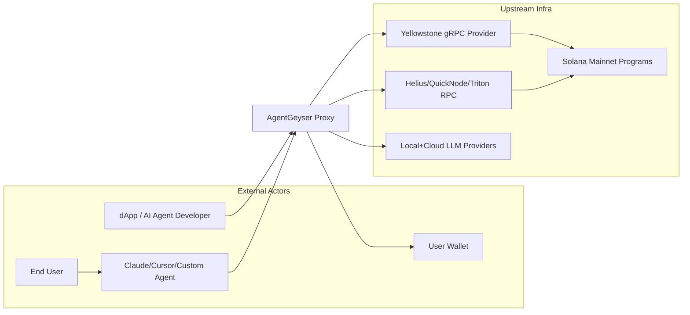
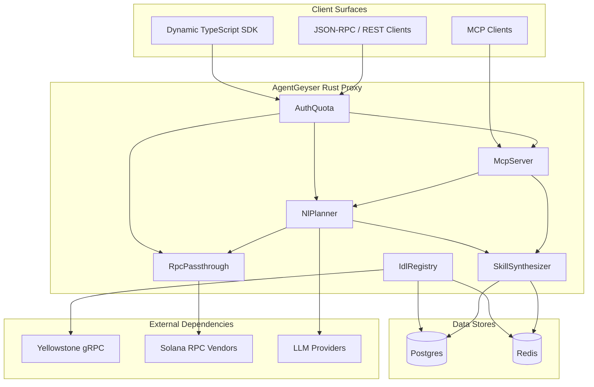

# AgentGeyser High-level Architecture & Data Flow

## Goals

- 定义 AgentGeyser 在系统边界上的 C4 架构（Context / Container / Component）。
- 说明从链上 Program 变化到技能可调用输出的关键路径。
- 对核心架构决策给出可审计的 alternatives 与 trade-offs，支撑后续 F4–F11 详细设计。

## Non-Goals

- 不提供具体 Rust crate 级函数实现细节（见后续模块文档）。
- 不定义完整 API schema（由 F10 完成）。
- 不定义数据库 DDL（由 F11 完成）。

## Context

本文 fulfills `B.F3.1`, `B.F3.2`, `B.F3.3`, `B.F3.4`。  
命名遵循 canonical registry：`IdlRegistry`, `SkillSynthesizer`, `NlPlanner`, `McpServer`, `RpcPassthrough`, `AuthQuota`；  
JSON-RPC 方法采用 `ag_listSkills`, `ag_invokeSkill`, `ag_planNL`, `ag_getIdl`。

Upstream references:

- [F1 Vision](./01-vision.md)
- [F2 Competitive Landscape](./02-competitive-landscape.md)

## Design

### C4 — System Context



Context 解释：

- AgentGeyser 位于 Agent/dApp 与 Solana 基础设施之间，提供语义增强层而非替代钱包。
- 钱包签名保持在用户侧，维持 non-custodial 边界。
- 上游同时依赖流式数据（Geyser）与传统 RPC（read/write passthrough）。

### C4 — Container Diagram



Container 解释：

- 控制平面：`IdlRegistry` + `SkillSynthesizer` 负责“学习并发布能力”。
- 执行平面：`NlPlanner` + `RpcPassthrough` 负责“规划并执行链上动作”。
- 接入平面：SDK / MCP / JSON-RPC 统一走 `AuthQuota` 治理。

### C4 — Component Diagram (inside AgentGeyser Proxy)

```mermaid
flowchart LR
  subgraph AGCore[AgentGeyser Core Components]
    AQ[AuthQuota\n(authn/rate-limit/quota)]
    RP[RpcPassthrough\n(raw Solana methods)]
    IR[IdlRegistry\n(program+idl ingestion)]
    SS[SkillSynthesizer\n(idl -> skills)]
    NP[NlPlanner\n(intent -> tx plan)]
    MS[McpServer\n(mcp tools/resources/prompts)]
    AL[AuditLog Writer]
  end

  AQ --> RP
  AQ --> NP
  AQ --> MS
  IR --> SS
  SS --> NP
  SS --> MS
  NP --> RP
  NP --> AL
  MS --> AL
```

Component 解释：

- `AuthQuota` 是入口守门层，避免绕过配额直接访问高成本路径（如 NL planning）。
- `IdlRegistry` 与 `SkillSynthesizer` 解耦：前者关注事实采集，后者关注语义抽象。
- `AuditLog Writer` 为 `ag_invokeSkill` 与 `ag_planNL` 提供全链路可追溯记录。

### Primary Data Flows

#### Flow 1 — New Program Discovery（新 Program 发现到技能发布）

1. `IdlRegistry` 订阅 Yellowstone gRPC，监听 program deploy/upgrade 事件。
2. 发现新 Program 后抓取 Anchor IDL；若缺失则触发 discriminator scan + LLM fallback 语义推断。
3. 标准化后写入 `Program` / `Idl` 版本记录（Postgres）并刷新 Redis 热缓存。
4. `SkillSynthesizer` 消费变更事件，将 IDL 指令映射为 `Skill` / `SkillVersion`。
5. 新技能通过 `ag_listSkills` 与 MCP resources 对外可见。

#### Flow 2 — Skill Invocation（技能调用执行路径）

1. Client 调用 `ag_invokeSkill`（或 SDK 动态方法）进入 `AuthQuota`。
2. `AuthQuota` 完成认证、速率限制、租户配额检查。
3. `SkillSynthesizer` 提供目标 skill schema 与参数校验规则。
4. `RpcPassthrough` 组装并提交交易到上游 Solana RPC。
5. 结果与关键元数据写入 `Invocation` / `AuditLog`。

#### Flow 3 — NL Planning（自然语言规划路径）

1. Agent 通过 `ag_planNL` 或 MCP tool 提交自然语言目标与约束（预算、滑点、时限）。
2. `NlPlanner` 进行 intent 解析与 tool routing，检索候选 skills。
3. 生成候选交易计划并调用 `simulateTransaction` 评估可执行性。
4. 执行优先费建议与 MEV 风险标注，返回可解释 plan（含置信度与拒绝原因）。
5. 若用户确认，进入 `ag_invokeSkill` 执行链路并审计落盘。

## Key Decisions & Alternatives

| Decision | Chosen Architecture | Alternative | Trade-offs |
|---|---|---|---|
| D1: System role | 智能语义代理层（proxy+learning） | 纯 RPC 网关 | 语义层价值高但实现复杂、需维护更多状态 |
| D2: Ingestion strategy | Geyser 实时订阅 + 增量更新 | 定时批处理抓取 | 实时性与新协议响应更优，但要处理回压与重连复杂度 |
| D3: Module boundary | `IdlRegistry` 与 `SkillSynthesizer` 分离 | 合并为单模块 | 分离利于演进与测试；代价是事件契约与一致性维护 |
| D4: Planner safety | 默认 simulation + MEV/fee 分析 | 直接生成并广播交易 | 安全与可解释性更好，但增加延迟与计算成本 |
| D5: Multi-surface exposure | JSON-RPC + SDK + MCP 同时支持 | 仅保留单一 SDK | 生态覆盖更广，代价是接口治理和版本兼容负担 |
| D6: Data layer | Postgres(事实/版本) + Redis(热路径) | 仅 Redis 或仅 Postgres | 双存储性能/一致性平衡更好，但运维复杂度上升 |

## Risks & Open Questions

- **Risk**：非 Anchor Program 语义推断的准确率波动会影响 skill 可用性。  
  **Mitigation**：输出置信度、支持人工覆写与快速回滚 `SkillVersion`。
- **Risk**：上游 Geyser 流抖动导致学习链路延迟。  
  **Mitigation**：重连策略、断点续传游标、事件幂等处理。
- **Risk**：NL 路径成本可能超出目标预算。  
  **Mitigation**：分层模型路由（local first, cloud escalation）+ plan cache。
- **Open Question**：MVP 阶段的默认 skill 审核策略是“全自动发布”还是“灰度发布 + 人审抽样”？
- **Open Question**：多租户隔离在 Beta 前是否需要逻辑库分片（per-tenant partition）？

## References

- [F1 Vision & Problem Statement](./01-vision.md)
- [F2 Competitive Landscape](./02-competitive-landscape.md)
- [C4 Model](https://c4model.com/)
- [Yellowstone gRPC (reference)](https://github.com/rpcpool/yellowstone-grpc)
- [Model Context Protocol](https://modelcontextprotocol.io/)

<!--
assertion-evidence:
  B.F3.1: frontmatter at document top includes doc/title/owner/status/depends-on/updated
  B.F3.2: mermaid C4 diagrams in sections "C4 — System Context", "C4 — Container Diagram", "C4 — Component Diagram"
  B.F3.3: section "Primary Data Flows" includes 3 flows: new-program discovery, skill invocation, NL planning
  B.F3.4: section "Key Decisions & Alternatives" lists 6 architectural decisions with alternatives and trade-offs
-->
