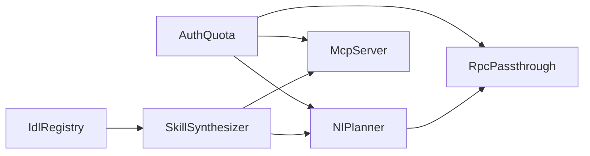

# AgentGeyser Module Decomposition & Responsibility Boundaries

## Goals

- 定义 AgentGeyser 的六个 canonical 模块：`IdlRegistry`、`SkillSynthesizer`、`NlPlanner`、`McpServer`、`RpcPassthrough`、`AuthQuota`。
- 为每个模块明确职责边界、输入/输出、owned data，避免跨模块隐式耦合。
- 提供 Rust trait 与 TypeScript interface 契约，作为后续实现与测试的稳定边界。

## Non-Goals

- 不定义完整数据库 DDL（见 [F11](./11-data-model.md)）。
- 不定义外部 API 的完整 JSON Schema（见 F10）。
- 不给出 crate 内部私有函数级实现细节。

## Context

本文 fulfills `B.F4.1`, `B.F4.2`, `B.F4.3`, `B.F4.4`。  
上游架构参考 [F3 Architecture](./03-architecture.md)；命名严格遵循 canonical registry。

## Design

### Module Interaction Map



### 1) `IdlRegistry`

**Responsibilities**
- 订阅 Geyser/链上信号并发现 Program 版本变化。
- 拉取或生成 IDL（Anchor 优先，非 Anchor 走 scan/fallback）。
- 对 `Program` 与 `Idl` 执行版本化、回滚标记、缓存失效广播。

**Inputs**
- Program lifecycle 事件（deploy/upgrade/close）。
- 上游 RPC account/program metadata。
- 可选语义增强结果（fallback pipeline）。

**Outputs**
- `IdlSnapshot` 版本事件流（供 `SkillSynthesizer` 消费）。
- `ag_getIdl` 查询所需的规范化 IDL 文档。

**Owned Data**
- `Program`, `Idl` 主事实数据（持久层主写入者）。
- IDL 热缓存与版本索引键空间（缓存层主写入者）。

### 2) `SkillSynthesizer`

**Responsibilities**
- 将 IDL 指令映射为语义化 `Skill` 与 `SkillVersion`。
- 维护参数 schema、副作用标签、置信度元数据。
- 向调用面提供技能检索与参数校验能力。

**Inputs**
- `IdlRegistry` 输出的 `IdlSnapshot` 更新事件。
- 策略配置（archetype 规则、LLM prompt 模板）。

**Outputs**
- skill catalog（供 `ag_listSkills` / MCP resources / SDK 动态方法发现）。
- invocation 前置参数校验与 schema 查询结果。

**Owned Data**
- `Skill`, `SkillVersion` 的生成规则与版本元数据。
- 技能索引缓存（program→skills, tag→skills）。

### 3) `NlPlanner`

**Responsibilities**
- 将自然语言意图解析为可执行的交易计划（plan）。
- 基于 skill catalog 路由工具，执行 simulation、priority-fee 与 MEV 风险评估。
- 生成可解释 plan 与审计记录草稿。

**Inputs**
- 用户意图文本与约束（budget/slippage/deadline）。
- `SkillSynthesizer` 的 schema/catalog。
- `RpcPassthrough` 的链上读能力（simulate, quote, state read）。

**Outputs**
- `PlannedTransaction`（步骤、参数、估算费用、风险标记）。
- 对 `Invocation` / `AuditLog` 的 planning 阶段记录。

**Owned Data**
- 临时 plan graph、tool-call trace（短期缓存）。
- planner policy 版本（prompt/tool-routing policy）。

### 4) `McpServer`

**Responsibilities**
- 对 MCP client 暴露 tools/resources/prompts。
- 将 MCP 请求映射到 `ag_listSkills` / `ag_planNL` / `ag_invokeSkill` 能力。
- 统一返回 MCP 协议兼容错误与可观测元数据。

**Inputs**
- MCP transport 请求（initialize/list_tools/call_tool/read_resource）。
- `SkillSynthesizer` 提供的目录与 schema。
- `NlPlanner`、`RpcPassthrough` 的执行能力。

**Outputs**
- MCP tools 调用结果、resource 文档、prompt 模板内容。
- 协议级 telemetry（latency、tool success/failure、quota headers）。

**Owned Data**
- MCP session capability 状态（短生命周期）。
- MCP response normalization 规则。

### 5) `RpcPassthrough`

**Responsibilities**
- 代理标准 Solana JSON-RPC 方法到上游节点。
- 对标准调用做重试、超时、幂等键与节点降级。
- 为 `NlPlanner` / skill invocation 提供统一链上访问面。

**Inputs**
- 内部 typed 请求（simulate/send/getAccount/getProgramAccounts 等）。
- 上游节点健康状态与路由策略。

**Outputs**
- 标准化 RPC 响应与错误分类（retryable/non-retryable）。
- 执行指标（endpoint latency、upstream error-rate）。

**Owned Data**
- 上游节点路由状态（熔断器/健康分）。
- 短期响应缓存（只读请求）。

### 6) `AuthQuota`

**Responsibilities**
- API key 验证、租户识别、权限矩阵检查。
- 按 endpoint/model/path 执行速率限制与配额计量。
- 将身份上下文注入下游模块，保障审计与计费一致性。

**Inputs**
- 请求凭据（API key / bearer token / mTLS metadata）。
- 租户策略（plan limits、burst、allowed methods）。

**Outputs**
- `RequestContext`（tenant_id, scopes, quota state）。
- 拒绝决策（401/403/429）与可解释 quota headers。

**Owned Data**
- 令牌桶计数器、月度配额账本（通常在 Redis/Postgres）。
- key rotation 状态与 revoked-key 列表。

### Rust Trait Contracts

```rust
use async_trait::async_trait;

pub struct RequestContext {
    pub tenant_id: String,
    pub scopes: Vec<String>,
    pub request_id: String,
}

pub struct ProgramEvent {
    pub program_id: String,
    pub slot: u64,
    pub event_type: String, // deploy | upgrade | close
}

pub struct IdlSnapshot {
    pub program_id: String,
    pub idl_version: i32,
    pub payload_json: String,
}

pub struct SkillDescriptor {
    pub skill_id: String,
    pub name: String,
    pub version: i32,
    pub input_schema_json: String,
}

pub struct PlanRequest {
    pub utterance: String,
    pub constraints_json: String,
}

pub struct PlannedTransaction {
    pub summary: String,
    pub steps_json: String,
    pub risk_flags: Vec<String>,
}

#[async_trait]
pub trait IdlRegistry {
    async fn ingest_program_event(&self, event: ProgramEvent) -> anyhow::Result<IdlSnapshot>;
    async fn get_idl(&self, program_id: &str, version: Option<i32>) -> anyhow::Result<IdlSnapshot>;
}

#[async_trait]
pub trait SkillSynthesizer {
    async fn synthesize_from_idl(&self, idl: &IdlSnapshot) -> anyhow::Result<Vec<SkillDescriptor>>;
    async fn list_skills(&self, program_id: Option<&str>) -> anyhow::Result<Vec<SkillDescriptor>>;
}

#[async_trait]
pub trait NlPlanner {
    async fn plan(&self, ctx: &RequestContext, req: PlanRequest) -> anyhow::Result<PlannedTransaction>;
}

#[async_trait]
pub trait McpServer {
    async fn list_tools(&self, ctx: &RequestContext) -> anyhow::Result<String>;
    async fn call_tool(&self, ctx: &RequestContext, tool_name: &str, input_json: &str) -> anyhow::Result<String>;
}

#[async_trait]
pub trait RpcPassthrough {
    async fn call_rpc(&self, ctx: &RequestContext, method: &str, params_json: &str) -> anyhow::Result<String>;
}

#[async_trait]
pub trait AuthQuota {
    async fn authorize(&self, headers_json: &str, method: &str) -> anyhow::Result<RequestContext>;
    async fn charge(&self, ctx: &RequestContext, units: u32) -> anyhow::Result<()>;
}
```

### TypeScript Interface Contracts

```ts
export interface RequestContext {
  tenantId: string;
  scopes: string[];
  requestId: string;
}

export interface IdlSnapshot {
  programId: string;
  idlVersion: number;
  payload: Record<string, unknown>;
}

export interface SkillDescriptor {
  skillId: string;
  name: string;
  version: number;
  inputSchema: Record<string, unknown>;
}

export interface PlannedTransaction {
  summary: string;
  steps: Array<Record<string, unknown>>;
  riskFlags: string[];
}

export interface IdlRegistry {
  ingestProgramEvent(event: { programId: string; slot: number; eventType: "deploy" | "upgrade" | "close" }): Promise<IdlSnapshot>;
  getIdl(programId: string, version?: number): Promise<IdlSnapshot>;
}

export interface SkillSynthesizer {
  synthesizeFromIdl(idl: IdlSnapshot): Promise<SkillDescriptor[]>;
  listSkills(programId?: string): Promise<SkillDescriptor[]>;
}

export interface NlPlanner {
  plan(ctx: RequestContext, req: { utterance: string; constraints?: Record<string, unknown> }): Promise<PlannedTransaction>;
}

export interface McpServer {
  listTools(ctx: RequestContext): Promise<Array<{ name: string; description: string }>>;
  callTool(ctx: RequestContext, toolName: string, input: Record<string, unknown>): Promise<Record<string, unknown>>;
}

export interface RpcPassthrough {
  callRpc(ctx: RequestContext, method: string, params: unknown[]): Promise<unknown>;
}

export interface AuthQuota {
  authorize(headers: Record<string, string>, method: string): Promise<RequestContext>;
  charge(ctx: RequestContext, units: number): Promise<void>;
}
```

## Key Decisions & Alternatives

| Decision | Chosen | Alternative | Trade-off |
|---|---|---|---|
| Module count | 固定 6 模块，按职责分层 | 合并为 3 大模块 | 6 模块边界清晰、可并行开发；但集成契约更多 |
| Contract style | Rust trait + TS interface 双契约 | 仅一种语言契约 | 双契约便于多端同步；代价是维护成本增加 |
| Ownership rule | 单一模块主写 owned data | 多模块共享写 | 降低一致性歧义；代价是跨模块编排步骤增加 |
| Auth placement | `AuthQuota` 作为所有入口前置层 | 分散到各模块内部 | 安全与计费一致性更强；代价是入口链路增加一次 hop |
| Planner dependency | `NlPlanner` 通过 `SkillSynthesizer` 间接访问能力 | 直接读取 IDL | 语义稳定且复用技能层；但增加一层间接性 |

## Risks & Open Questions

- **Risk**: trait/interface 演进时若无版本策略，可能导致 SDK 与 proxy 兼容性裂缝。  
  **Owner**: API Working Group.
- **Risk**: `RpcPassthrough` 与 `NlPlanner` 的错误码映射不一致会损害可观测性。  
  **Owner**: Runtime Platform.
- **Open Question**: `AuthQuota.charge` 是否应支持“模拟调用折扣单价”策略？
- **Open Question**: MCP 长会话是否需要独立 quota bucket（session-aware）？

## References

- [F3 High-level Architecture](./03-architecture.md)
- [Model Context Protocol](https://modelcontextprotocol.io/)
- [Rust async-trait crate](https://docs.rs/async-trait/latest/async_trait/)
- [TypeScript Handbook: Interfaces](https://www.typescriptlang.org/docs/handbook/interfaces.html)

<!--
assertion-evidence:
  B.F4.1: frontmatter at lines 1-7 includes doc/title/owner/status/depends-on/updated
  B.F4.2: Design defines six modules explicitly: IdlRegistry, SkillSynthesizer, NlPlanner, McpServer, RpcPassthrough, AuthQuota
  B.F4.3: Each module subsection documents responsibilities, inputs, outputs, and owned data
  B.F4.4: Sections "Rust Trait Contracts" and "TypeScript Interface Contracts" provide interface contracts
-->
