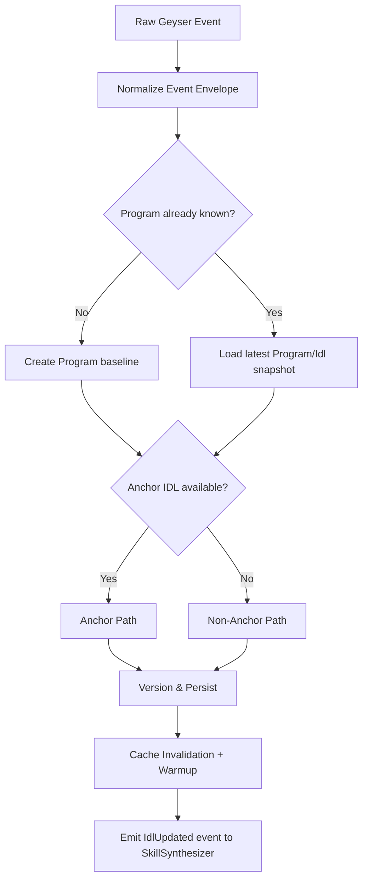

# IDL Registry & Continuous Learning Pipeline

## Goals

- 定义 `IdlRegistry` 如何通过 Yellowstone gRPC 实时发现 Program 变化并稳定摄取。
- 统一描述 Anchor 与 non-Anchor 两条 IDL 获取/推断路径及收敛策略。
- 明确 `Program` / `Idl` 的版本化、回滚与缓存失效机制，确保下游 `SkillSynthesizer` 一致可用。

## Non-Goals

- 不定义 `SkillSynthesizer` 的语义映射细节（见后续 F6）。
- 不定义完整数据库 DDL（见 F11）。
- 不实现真实链上反编译器，仅定义 fallback pipeline contract 与质量门槛。

## Context

本文 fulfills `C.F5.1`, `C.F5.2`, `C.F5.3`, `C.F5.4`，并继承：

- [F3 Architecture](./03-architecture.md) 的三层数据流与组件边界；
- [F4 Modules](./04-modules.md) 中 `IdlRegistry` 对 `Program`/`Idl` 的 ownership。

Canonical names 保持一致：`IdlRegistry`, `SkillSynthesizer`, `NlPlanner`, `McpServer`, `RpcPassthrough`, `AuthQuota`。

## Design

### 1) Geyser Subscription Topology (Yellowstone gRPC)

```mermaid
flowchart LR
  subgraph Upstream
    YG[Yellowstone gRPC]
  end

  subgraph IdlRegistry
    SUB[Subscription Manager]
    FIL[Filter Router\n(program/account filters)]
    BUF[Backpressure Buffer]
    REC[Reconnect Supervisor]
    EVT[Event Normalizer]
  end

  subgraph Storage
    PG[(Postgres Program/Idl)]
    RD[(Redis Hot Cache)]
  end

  YG --> SUB --> FIL --> BUF --> EVT
  SUB <--> REC
  EVT --> PG
  EVT --> RD
```

**Filter strategy**

- Program lifecycle 关注两类订阅：
  1. `program` 级事件（部署、升级相关变更）；
  2. 与 IDL 相关的关键 account 变更（例如 Anchor IDL account 或约定元数据 PDA）。
- `Filter Router` 维护“全局基础过滤器 + 已知重点 Program 精细过滤器”：
  - 新 Program 发现阶段使用较宽过滤器；
  - 进入稳定跟踪后切换到 program-specific filters 降低噪音。

**Reconnect policy**

- 指数退避：`1s → 2s → 4s ... max 30s`，加入抖动避免雪崩重连。
- 每次重连保留最后确认的 slot watermark，恢复后从 watermark+1 对齐（若上游支持）。
- 连续失败超过阈值触发 degraded mode：仅保留关键 Program 订阅并告警。

**Backpressure policy**

- `BUF` 采用有界队列（按 tenant/global 双阈值）：
  - 达到 soft limit：优先丢弃低优先级重复事件（同 program + 同 slot 合并）。
  - 达到 hard limit：进入保护模式，暂停非关键过滤器并拉高采样。
- 事件处理按 program 分区并行，单分区内保持 slot 有序，避免版本穿插。

### 2) Ingestion & Normalization Pipeline



统一事件包（normalized envelope）至少包含：

- `program_id`
- `source_slot`
- `source_signature`（若可得）
- `event_kind`（deploy/upgrade/account_change）
- `ingested_at`
- `dedupe_key`

`dedupe_key = program_id + source_slot + event_kind + hash(payload)` 用于幂等写入与重放保护。

### 3) Anchor IDL Path

Anchor 路径是首选（高精度、结构化）：

1. 基于已知 Anchor 约定定位 IDL account（或项目声明的 metadata pointer）。
2. 拉取并解码 IDL JSON，做 schema sanity checks：
   - 必须包含 `instructions`；
   - account/type 定义引用闭包完整；
   - 版本号可解析（缺失则生成 registry-local revision）。
3. 规范化字段命名（例如 account mutability、signer 语义），生成 canonical `Idl` 表示。
4. 与现有版本做内容哈希比对：
   - 哈希相同：仅更新时间戳，不创建新版本；
   - 哈希变化：创建 `Idl` 新 revision 并触发下游合成。

### 4) Non-Anchor Path: Discriminator Scan + LLM Fallback

当无法获得 Anchor IDL 时，走推断路径：

1. **Discriminator scan**
   - 扫描 Program 相关指令数据前缀与已知 discriminator 模式；
   - 聚合近期 transaction logs / instruction payload 样本；
   - 构造候选 instruction 集合（name 占位 + 参数字节布局候选）。
2. **Static heuristics**
   - 识别常见 SPL/DeFi 模式（transfer/swap/stake/mint）；
   - 从 account 读写行为推断 signer/writable 约束。
3. **LLM fallback annotation**
   - 将“字节布局候选 + 账户访问图 + 日志片段”提交给语义标注模型；
   - 产出 `probabilistic IDL draft`（含每条 instruction 置信度）。
4. **Quality gate**
   - 低于置信度阈值的 instruction 不对外暴露为默认可调用 skill；
   - 标记为 `experimental`，仅允许显式 opt-in。
5. **Human override hook**
   - 支持运营侧提交修订版 IDL patch，形成受审计的新 revision。

该路径强调“可追溯 + 可回滚”，避免把不确定推断当作确定事实。

### 5) Versioning Model & Rollback

`IdlRegistry` 对 `Program` 与 `Idl` 采用 append-only revision 模型：

- `Program`：逻辑实体，稳定主键为 `program_id`。
- `Idl`：按 `program_id` 维护 `revision`（单调递增）与 `content_hash`。
- `state`：`active | superseded | rolled_back | experimental`。

**Version creation rules**

- 内容哈希变化才创建新 revision；
- 来源标记：`anchor`, `scan`, `llm`, `manual_override`；
- 每个 revision 记录 `derived_from_revision`（若为回滚/覆写链路）。

**Rollback rules**

- 允许将 `active` 指针回退到任意历史 revision；
- 回滚本身生成一条新 revision 事件（而非原地改状态），确保审计可重放；
- 回滚后触发 `SkillSynthesizer` 重新生成 `SkillVersion`，并传播版本变更通知。

### 6) Cache Invalidation Strategy

缓存分层：

- L1: 进程内短 TTL cache（毫秒级热点读取）；
- L2: Redis 共享缓存（跨实例一致）。

关键 key 设计（示例）：

- `idl:active:{program_id}` → 当前 active revision 摘要（TTL 10m）
- `idl:rev:{program_id}:{revision}` → 完整 canonical IDL（TTL 24h）
- `idl:etag:{program_id}` → 版本 etag/hash（TTL 10m）

**Invalidation triggers**

1. 新 revision 激活；
2. 回滚完成；
3. 人工 override 发布；
4. 数据质量判定从 `experimental` 转 `active` 或反向降级。

**Invalidation mechanics**

- Write-through：先落 Postgres，再发布 cache-bust 事件；
- 消费 cache-bust 事件后删除/更新 `idl:active:*` 与相关 etag；
- 触发异步 warmup，预热最近 N 个高频 program 的 active IDL。

这样可兼顾一致性与命中率：读取可短暂容忍旧值，但 etag mismatch 会强制刷新。

## Key Decisions & Alternatives

| Decision | Chosen | Alternative | Trade-off |
|---|---|---|---|
| Ingestion mode | Yellowstone gRPC 实时订阅 | 定时全量轮询 | 实时性高、延迟低；但需处理重连与回压复杂度 |
| IDL source priority | Anchor-first, non-Anchor fallback | 全部走统一反推 | Anchor 路径精度更高；双路径实现复杂 |
| Non-Anchor reliability | scan + heuristics + LLM + quality gate | 仅 LLM 直出 | 降低 hallucination 风险；代价是 pipeline 更长 |
| Version semantics | append-only revisions + pointer rollback | 原地覆盖最新版本 | 审计/可追溯性好；存储与查询复杂度上升 |
| Cache strategy | L1+L2 + 事件驱动失效 | 仅 TTL 被动过期 | 一致性更可控；需要额外事件通道 |

## Risks & Open Questions

- **Risk**: 上游 Geyser 短时中断可能导致 slot 缺口。  
  **Mitigation**: watermark 恢复 + gap 检测后补拉。
- **Risk**: non-Anchor 推断误差会污染下游 skill catalog。  
  **Mitigation**: confidence gate + experimental 标记 + 人工覆写入口。
- **Risk**: 高频 Program 升级导致缓存抖动和下游再合成风暴。  
  **Mitigation**: revision debounce（窗口内合并）与按 program 限流。
- **Open Question**: MVP 是否需要“按租户可见 revision”以支持灰度发布？
- **Open Question**: 对极度动态 Program，是否引入“只读模式”直到稳定窗口满足阈值？

## References

- [F3 High-level Architecture](./03-architecture.md)
- [F4 Module Decomposition](./04-modules.md)
- [Yellowstone gRPC](https://github.com/rpcpool/yellowstone-grpc)
- [Anchor Project](https://www.anchor-lang.com/)

<!--
assertion-evidence:
  C.F5.1: frontmatter at document top includes doc/title/owner/status/depends-on/updated
  C.F5.2: section "1) Geyser Subscription Topology (Yellowstone gRPC)" covers filters, reconnect policy, and backpressure policy with mermaid topology
  C.F5.3: sections "3) Anchor IDL Path" and "4) Non-Anchor Path: Discriminator Scan + LLM Fallback" cover both acquisition paths
  C.F5.4: sections "5) Versioning Model & Rollback" and "6) Cache Invalidation Strategy" specify versioning, rollback, and cache invalidation rules
-->
