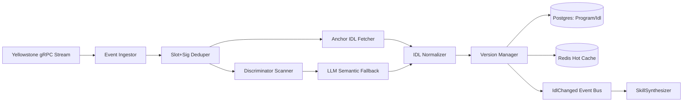

# AgentGeyser IDL Registry & Continuous Learning Pipeline

## Goals

- 定义 `IdlRegistry` 如何通过 Yellowstone gRPC 持续发现 Program 变更并触发 IDL 更新。
- 设计双路径摄取：Anchor IDL fast path + 非 Anchor discriminator-scan/LLM fallback path。
- 规定 `Idl` 版本化、回滚与缓存失效策略，确保下游 `SkillSynthesizer` 读取一致、可追溯的数据。

## Non-Goals

- 不定义 Skill 语义映射规则（见后续 F6 `SkillSynthesizer` 文档）。
- 不定义完整数据库 DDL 与索引细节（由 F11 覆盖）。
- 不落地真实 Helius/Triton API 调用代码，仅给出架构与协议层设计。

## Context

本文 fulfills `C.F5.1`, `C.F5.2`, `C.F5.3`, `C.F5.4`。  
依赖与命名参照：

- [F3 Architecture](./03-architecture.md)
- [F4 Modules](./04-modules.md)

Canonical names 使用：`IdlRegistry`, `SkillSynthesizer`, `RpcPassthrough`, `AuthQuota`；实体使用 `Program`, `Idl`, `Skill`, `SkillVersion`, `Invocation`, `AuditLog`。

## Design

### End-to-End Topology

拓扑说明：

- 所有上游链上变化首先进入 `Event Ingestor`，再做 slot/signature 级去重与幂等。
- Anchor 与 non-Anchor 两条路径并行竞争，最终统一进入 `IDL Normalizer`。
- `Version Manager` 是事实写入单点，确保版本单调递增、回滚可验证。

### Geyser Subscription Topology (Yellowstone gRPC)

`IdlRegistry` 订阅 Yellowstone gRPC 时采用 **multi-filter + resumable cursor** 策略：

1. **Program lifecycle filters**：关注 `BPF Upgradeable Loader` 相关账户写入与可执行 program account 变更。
2. **Known program-set filters**：已注册 Program 的 upgrade authority、program data 账户变化。
3. **Slot watermark stream**：记录处理到的 `slot` 与 `blockhash`，用于崩溃恢复。

#### Reconnect Strategy

- 使用指数退避（1s, 2s, 4s ... capped at 30s）重连 gRPC 流。
- 每次重连携带最近稳定 `slot watermark`，触发 provider 支持的 replay/range 拉取（若 provider 不支持，走补偿扫描）。
- 连续 N 次（默认 8 次）失败后切换备份 provider（同协议不同 endpoint）。

#### Backpressure Strategy

- Ingestor 使用有界队列（例如 `max_events=50k`），队列水位超过 80% 启动降级：
  - 优先保留 upgrade/deploy 事件；
  - 暂缓低价值 metadata 事件；
  - 将未处理计数写入 telemetry 并触发告警。
- Normalizer/Version Manager 采用批处理提交（按 slot 窗口 flush），避免高频小事务导致存储抖动。

### Path A — Anchor IDL Fast Path

Anchor 路径优先级最高，触发条件：

- Program account 能识别 Anchor discriminator 或具备已知 Anchor metadata 模式；
- 或存在可解析的 IDL account/PDA 路径。

处理步骤：

1. 读取 IDL account（或 Anchor convention 定义位置）。
2. 验证 JSON 完整性、instruction/account/types 字段结构。
3. 计算 `idl_content_hash`；若与最新版本一致则仅更新时间戳不增版本。
4. 标注 `source = "anchor"` 与 `confidence = 1.0` 后入库。

优势：语义准确、解析成本低、可直接供 `SkillSynthesizer` 消费。

### Path B — Non-Anchor Discriminator Scan + LLM Fallback

对于非 Anchor 合约，启用分层恢复路径：

1. **Discriminator Scan**
   - 扫描交易指令 data 前缀分布、账户元信息访问模式、已知 SPL/生态协议 signatures。
   - 生成候选 instruction skeleton（name 暂为 `op_<hex>`，参数为 bytes/layout 推断）。
2. **Static Heuristics Enrichment**
   - 利用 program logs、事件 topic、error code 频次做字段语义提示（如 `amount`, `mint`, `owner`）。
3. **LLM Semantic Fallback**
   - 将 scan 结果压缩成结构化 prompt，要求输出“最小可验证 IDL 草案”。
   - 模型输出必须通过 schema validator 与安全过滤器（禁止注入外部执行语句）。
4. **Confidence Gate**
   - 若 `confidence < threshold`（默认 0.72），标记为 `restricted`，仅允许 `ag_getIdl` 读取，不自动对外发布 skill。

该路径产物标记：

- `source = "scan+llm"`；
- `provenance` 包含扫描样本窗口、模型版本、prompt hash；
- 支持后续被 Anchor 真值覆盖并自动降级旧版本。

### Versioning & Rollback

`Idl` 采用 **append-only version chain**：

- 主键建议：`idl_id`(uuid) + `(program_id, version)` 唯一；
- `version` 从 1 开始单调递增；
- 每版记录 `parent_version`, `content_hash`, `source`, `confidence`, `state`.

`state` 生命周期：

- `active`: 当前默认读取版本；
- `superseded`: 被新版本替代但可回溯；
- `rolled_back`: 因质量/安全问题回滚后冻结；
- `restricted`: 低置信度，仅内部或受限读。

Rollback 机制：

1. 触发器：自动校验失败、人工审查拒绝、生产调用异常激增。
2. 操作：将目标坏版本置 `rolled_back`，把上一个健康版本重新标记 `active`。
3. 广播：发出 `IdlChanged(program_id, active_version, reason)` 事件给 `SkillSynthesizer` 重建 `SkillVersion`。

### Cache Invalidation Strategy

Redis 热缓存键建议（示例）：

- `ag:idl:active:{program_id}` → active IDL payload（TTL 10m + jitter）
- `ag:idl:ver:{program_id}:{version}` → 历史版本快照（TTL 24h）
- `ag:idl:etag:{program_id}` → content hash / etag（TTL 10m）

失效原则：

1. **Write-through on promote**：新 active 版本入库成功后同步更新 `ag:idl:active:*`。
2. **Event-driven invalidation**：回滚或降级时，删除 active/etag 键并发布失效事件。
3. **Stale-while-revalidate**：读取时若 TTL 过半可异步刷新，避免 cache stampede。
4. **Negative cache**：对“未发现 IDL”的 program 设置短 TTL（60s），减少重复扫描。

### Failure Handling & Consistency

- **Exactly-once effect (logical)**：通过 `(program_id, slot, tx_sig)` 幂等键确保重复事件不重复增版本。
- **At-least-once transport**：允许 gRPC 重放，靠 dedupe 层吸收。
- **Schema guardrail**：无论来源都必须通过统一 IDL schema validator；失败版本不可标记 active。
- **Downstream contract**：仅 `state=active` 且 `confidence` 达标版本会触发自动 skill 重建。

## Key Decisions & Alternatives

| Decision | Chosen | Alternative | Trade-off |
|---|---|---|---|
| Ingestion mode | Yellowstone gRPC 实时订阅 + watermark 恢复 | 定时全链扫描 | 实时性强但实现更复杂，需要重连/回压治理 |
| Anchor precedence | Anchor path 优先，scan 仅补缺 | 始终统一走 scan+LLM | Anchor 精准且便宜；双路径增加分支维护成本 |
| Non-Anchor synthesis | discriminator scan + LLM fallback | 仅手工维护 mapping | 自动覆盖面更高；需控制误报与模型成本 |
| Version model | append-only + state machine | 原地覆盖当前 IDL | 可审计可回滚；存储占用更高 |
| Cache strategy | write-through + event invalidation + SWR | 仅 TTL 被动过期 | 一致性更好；实现复杂度上升 |

## Risks & Open Questions

- **Risk**: provider replay 能力不一致，可能导致重连后事件缺口。  
  **Mitigation**: 保留补偿扫描任务（按 slot 区间重抓 program data）。
- **Risk**: LLM fallback 对新型协议可能高置信误判。  
  **Mitigation**: confidence gate + restricted state + 人工抽样审查。
- **Risk**: 高频升级期间 cache churn 影响读取延迟。  
  **Mitigation**: 引入 TTL jitter 与 per-program debounce 合并失效事件。
- **Open Question**: `restricted` 版本在 MVP 是否允许租户白名单提前使用？
- **Open Question**: 是否需要为特定蓝筹协议建立“手工真值优先级”覆盖自动管线？

## References

- [F3 High-level Architecture](./03-architecture.md)
- [F4 Module Decomposition](./04-modules.md)
- [Yellowstone gRPC](https://github.com/rpcpool/yellowstone-grpc)
- [Anchor Framework](https://www.anchor-lang.com/)

<!--
assertion-evidence:
  C.F5.1: frontmatter at document top includes doc/title/owner/status/depends-on/updated
  C.F5.2: section "Geyser Subscription Topology (Yellowstone gRPC)" details filters, reconnect strategy, and backpressure strategy
  C.F5.3: sections "Path A — Anchor IDL Fast Path" and "Path B — Non-Anchor Discriminator Scan + LLM Fallback" cover both ingestion paths
  C.F5.4: sections "Versioning & Rollback" and "Cache Invalidation Strategy" specify versioning, rollback, and cache invalidation
-->