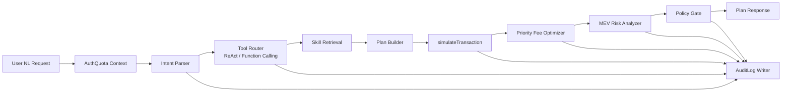
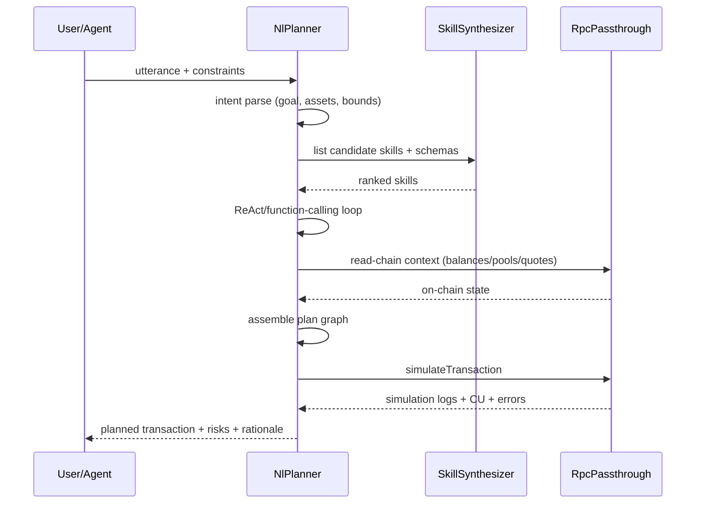

# AgentGeyser NL → Transaction Planner

## Goals

- 定义 `NlPlanner` 从自然语言意图到可执行交易计划（transaction plan）的完整管线。
- 说明 intent 识别、tool routing（ReAct/function-calling）、计划组装与安全闸门。
- 规定 `simulateTransaction`、priority-fee 优化、MEV 风险标注在规划阶段的强制位置。
- 定义每次规划都必须写入的 `AuditLog` 记录结构，支持追溯与合规。

## Non-Goals

- 不定义 `SkillSynthesizer` 的 IDL→Skill 映射规则（见 [F6](./06-skill-synthesizer.md)）。
- 不定义最终 JSON-RPC API 的完整 schema（见 F10）。
- 不负责真实私钥托管或签名执行（保持 non-custodial，签名由钱包完成）。

## Context

本文 fulfills `C.F7.1`, `C.F7.2`, `C.F7.3`, `C.F7.4`。  
模块边界遵循 [F4 Modules](./04-modules.md) 与 [F6 Skill Synthesizer](./06-skill-synthesizer.md)。

Canonical 命名保持一致：`NlPlanner`, `SkillSynthesizer`, `RpcPassthrough`, `AuthQuota`, `McpServer`；实体使用 `Invocation`, `AuditLog`。

## Design

### End-to-End Planning Pipeline



管线原则：

1. **Plan-first**：`NlPlanner` 默认输出“可解释计划”，而非直接广播交易。
2. **Safety-before-send**：simulation、fee、MEV 检查全部完成后才可进入执行入口。
3. **Audit-by-default**：每个阶段都记录结构化审计事件。

### Intent → Tool Route (ReAct / Function Calling)



#### Stage 1 — Intent Normalization

输入：
- `utterance`: 自然语言目标（例如“把 10 SOL 换成 USDC，最多 0.5% 滑点”）
- `constraints`: 可选约束（slippage, max fee, deadline, denylist programs）
- `context`: 认证租户、链环境、钱包地址（由 `AuthQuota` 注入）

输出：
- `intent`（结构化）：`action`, `asset_in`, `asset_out`, `amount`, `time_bound`, `risk_preference`
- `confidence`：意图解析置信度
- `missing_fields`：无法安全规划时要求补充的字段

#### Stage 2 — Tool Routing

路由策略：
- 优先使用 `SkillSynthesizer` 返回的 `SkillVersion`（含 schema/effects/confidence）。
- ReAct 模式用于多步规划（先查询余额，再报价，再组装 swap）。
- Function-calling 模式用于单步确定性任务（例如 transfer/mint）。

路由决策评分（示例）：
- `semantic_match`（意图与 skill archetype 一致度）
- `schema_fit`（用户参数可映射度）
- `safety_score`（risk_level + authority requirement）
- `execution_cost_estimate`（CU、priority fee 预测）

若最高分候选低于阈值（默认 0.65），返回“不可安全规划”并附解释，不进入后续执行准备。

#### Stage 3 — Plan Assembly

`NlPlanner` 产出 plan graph（DAG）：
- 节点类型：`read_state`, `invoke_skill`, `compose_tx`, `simulate`, `risk_check`
- 边含前置条件：账户存在性、余额充足、时间限制、quote 有效期
- 每个 `invoke_skill` 节点附 `SkillVersion`、参数映射、预期 side effects

输出对象 `PlannedTransaction` 至少包括：
- `summary`
- `steps[]`
- `required_signers[]`
- `estimated_compute_units`
- `pre_simulation_assumptions[]`
- `risk_flags[]`

### Simulation, Priority-Fee, and MEV Risk

#### Simulation (`simulateTransaction`)

强制要求（满足 C.F7.3）：
- 每个候选 plan 至少进行一次 `simulateTransaction`。
- 记录：
  - `simulation_ok`（bool）
  - `err_code` / `err_message`
  - `logs[]`
  - `units_consumed`
  - `post_token_balances`（若可得）

失败策略：
- 若 simulation 失败且无可恢复替代路径：返回 `plan_status=blocked` 与修复建议。
- 若存在备选技能路径：自动降级并重新模拟，最多 `max_replan_attempts=2`。

#### Priority-Fee Optimization

目标：在成功率与成本之间做 bounded optimization。

输入信号：
- 最近区块拥堵度（slot lag / pending tx density）
- 目标确认等级与时间约束（`deadline_ts`）
- simulation 的 CU 消耗估计

策略（示例）：
- 计算 `recommended_cu_price`（micro-lamports/CU）：
  - base percentile（p60/p75/p90）按租户策略选取
  - 拥堵高时上浮系数（1.1x~1.6x）
  - 对低价值交易施加 `max_fee_cap`
- 输出：
  - `priority_fee_strategy`: `conservative | balanced | aggressive`
  - `recommended_cu_limit`
  - `recommended_cu_price`
  - `estimated_total_fee_lamports`

#### MEV Risk Flags

`NlPlanner` 在规划阶段输出 MEV 风险标签：

- `sandwich_risk_high`：AMM swap 且滑点容忍过高、交易体量显著。
- `stale_quote_risk`：报价窗口接近过期或链上波动高。
- `pool_liquidity_risk`：目标池深度不足导致冲击成本高。
- `frontrun_surface`：多步计划中存在可观察、可抢跑中间状态。

缓解建议（返回给调用方）：
- 缩小 `slippageBps`
- 缩短 `deadlineTs`
- 增加 priority fee（在用户 cap 内）
- 使用受保护路由或私有中继（若租户策略允许）

### Audit Log Record Shape

每次 `ag_planNL`（或 MCP 等价调用）必须写入一条主记录 + 多条阶段事件（满足 C.F7.4）。

```json
{
  "audit_log_id": "uuid",
  "timestamp": "2026-04-23T22:40:00Z",
  "tenant_id": "tenant_123",
  "request_id": "req_abc",
  "surface": "json-rpc|mcp|sdk",
  "actor": {
    "type": "api_key|oauth|service",
    "subject": "user_or_agent_id"
  },
  "input": {
    "utterance_redacted": "Swap 10 SOL to USDC ...",
    "constraints": {
      "slippageBps": 50,
      "maxLamports": 2000000,
      "deadlineTs": 1770000000
    }
  },
  "intent": {
    "action": "swap",
    "confidence": 0.91,
    "missing_fields": []
  },
  "tool_routing": {
    "candidates": [
      { "skill_id": "skill_1", "score": 0.88 },
      { "skill_id": "skill_2", "score": 0.74 }
    ],
    "chosen_skill_id": "skill_1",
    "routing_mode": "react"
  },
  "simulation": {
    "ok": true,
    "units_consumed": 189000,
    "err_code": null
  },
  "priority_fee": {
    "strategy": "balanced",
    "recommended_cu_price": 4500,
    "estimated_total_fee_lamports": 1300000
  },
  "mev": {
    "risk_flags": ["sandwich_risk_high"],
    "mitigations": ["reduce_slippage", "shorten_deadline"]
  },
  "decision": {
    "plan_status": "ready|blocked|needs_user_input",
    "reason": "..."
  },
  "hashes": {
    "prompt_hash": "sha256:...",
    "policy_version": "planner-policy-v1"
  }
}
```

设计约束：
- `utterance_redacted` 必须脱敏（PII 与敏感地址可哈希化）。
- `prompt_hash` 与 `policy_version` 用于事后重放与归因。
- 记录与 `Invocation` 可关联（当用户确认并执行时）。

## Key Decisions & Alternatives

| Decision | Chosen | Alternative | Trade-off |
|---|---|---|---|
| Planner output mode | 默认返回 plan（不直接发送） | 直接广播交易 | 安全与可解释性更高；交互步骤增加 |
| Routing mechanism | ReAct + function-calling 混合 | 单一模板推理 | 兼顾多步复杂任务与低延迟单步任务；实现复杂 |
| Simulation policy | 每个 plan 强制 simulate | 仅高风险交易 simulate | 失败预防更好；增加 RPC 成本与延迟 |
| Fee strategy | 受约束的动态 priority-fee 优化 | 固定费率 | 确认成功率更高且成本可控；参数调优复杂 |
| MEV handling | 输出风险 flag + mitigation 建议 | 忽略 MEV | 风险透明度高；需要维护风险规则与信号 |
| Auditing depth | 全阶段结构化审计 | 仅最终结果日志 | 合规/调试能力强；存储与隐私治理开销更高 |

## Risks & Open Questions

- **Risk**: 意图解析在多语言/隐喻表达下可能误判。  
  **Mitigation**: 增加 `missing_fields` 交互回合与低置信拒绝策略。
- **Risk**: 高峰期 simulation 与 fee 建议可能快速过时。  
  **Mitigation**: 引入 quote TTL 与“发送前二次快照检查”。
- **Risk**: MEV 风险规则初期覆盖不足，导致漏报。  
  **Mitigation**: 结合历史 `AuditLog` 回放持续校准规则。
- **Open Question**: MVP 是否默认启用私有中继建议，还是仅企业租户可见？
- **Open Question**: 对于跨协议多跳路径，是否需要显式“逐跳可撤销性”评分？

## References

- [F4 Module Decomposition](./04-modules.md)
- [F6 Skill Synthesizer](./06-skill-synthesizer.md)
- [Solana JSON-RPC: simulateTransaction](https://solana.com/docs/rpc/http/simulatetransaction)
- [Model Context Protocol](https://modelcontextprotocol.io/)

<!--
assertion-evidence:
  C.F7.1: frontmatter at document top includes doc/title/owner/status/depends-on/updated
  C.F7.2: sections "End-to-End Planning Pipeline" and "Intent → Tool Route (ReAct / Function Calling)" with mermaid diagram specify intent-to-tool routing pipeline
  C.F7.3: section "Simulation, Priority-Fee, and MEV Risk" explicitly covers simulateTransaction, priority-fee optimization, and MEV risk flags
  C.F7.4: section "Audit Log Record Shape" defines structured audit-log schema for every planned transaction
-->
