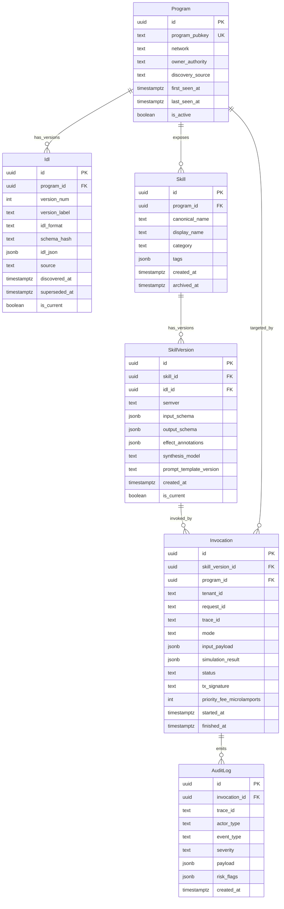

## Goals

- 定义 AgentGeyser 核心实体 `Program`、`Idl`、`Skill`、`SkillVersion`、`Invocation`、`AuditLog` 的统一数据模型。
- 给出可落地的关系模型（ER 图）以支持 IDL 版本化、技能演化、调用追踪与审计。
- 提供 Postgres DDL（每个实体至少一张主表），确保约束、索引和查询路径明确。
- 规范 Redis key-space（前缀命名、TTL 策略、淘汰策略）以服务低延迟读取与限流。

## Non-Goals

- 不在本文件定义完整 API contract（见 [F10 API](./10-api.md)）。
- 不实现具体迁移脚本执行流程（如 Flyway/Liquibase pipeline）。
- 不引入新 canonical 实体名；仅使用 mission 约定六个实体。
- 不覆盖对象存储（S3）或数据仓库（OLAP）归档细节。

## Context

本数据模型对齐以下上游设计：

- [F5 IDL Registry](./05-idl-registry.md)：`Program`/`Idl` 的采集、版本回滚与缓存失效策略。
- [F6 Skill Synthesizer](./06-skill-synthesizer.md)：`Skill`/`SkillVersion` 的语义生成、参数 schema 与版本管理。
- [F7 NL Planner](./07-nl-planner.md)：`Invocation` 与 `AuditLog` 的计划/执行/风险审计关联。
- [F10 API](./10-api.md)：`ag_listSkills`、`ag_invokeSkill`、`ag_planNL`、`ag_getIdl` 对读写路径的约束。

设计原则：

1. **Write-optimized + Read-indexed**：Postgres 持久化强一致，Redis 做热点加速。
2. **Version-first**：IDL 与 SkillVersion 均不可变追加（append-only），回滚通过引用切换。
3. **Auditability by default**：每次 Invocation 必有审计锚点，跨 trace 可追溯。
4. **Tenant-aware**：多租户隔离字段贯穿调用与日志实体。

## Design

### 1) ER Diagram（D.F11.2）



关系解释：

- `Program` 是根实体，承载 on-chain program 的身份与生命周期。
- `Idl` 按 `program_id + version_num` 递增存储，`is_current` 标记当前生效版本。
- `Skill` 是 Program 下语义能力抽象（如 `swap`、`transfer`）。
- `SkillVersion` 绑定具体 `Idl` 快照，保证技能可重放与可审计。
- `Invocation` 记录一次技能调用（包括 dry-run/simulate 结果与链上提交结果）。
- `AuditLog` 记录每次调用中策略决策、风控标记、异常与安全事件。

### 2) Postgres DDL（D.F11.3）

> 说明：DDL 采用 PostgreSQL 15+ 语法；启用 `pgcrypto` 以使用 `gen_random_uuid()`。

```sql
CREATE EXTENSION IF NOT EXISTS pgcrypto;

-- 1) Program
CREATE TABLE IF NOT EXISTS program (
  id UUID PRIMARY KEY DEFAULT gen_random_uuid(),
  program_pubkey TEXT NOT NULL UNIQUE,
  network TEXT NOT NULL DEFAULT 'mainnet-beta',
  owner_authority TEXT,
  discovery_source TEXT NOT NULL,
  first_seen_at TIMESTAMPTZ NOT NULL DEFAULT now(),
  last_seen_at TIMESTAMPTZ NOT NULL DEFAULT now(),
  is_active BOOLEAN NOT NULL DEFAULT true,
  metadata JSONB NOT NULL DEFAULT '{}'::jsonb,
  CONSTRAINT program_network_chk CHECK (network IN ('mainnet-beta', 'devnet', 'testnet', 'localnet'))
);

CREATE INDEX IF NOT EXISTS idx_program_network_active
  ON program (network, is_active);

-- 2) Idl
CREATE TABLE IF NOT EXISTS idl (
  id UUID PRIMARY KEY DEFAULT gen_random_uuid(),
  program_id UUID NOT NULL REFERENCES program(id) ON DELETE CASCADE,
  version_num INTEGER NOT NULL,
  version_label TEXT,
  idl_format TEXT NOT NULL,
  schema_hash TEXT NOT NULL,
  idl_json JSONB NOT NULL,
  source TEXT NOT NULL,
  discovered_at TIMESTAMPTZ NOT NULL DEFAULT now(),
  superseded_at TIMESTAMPTZ,
  is_current BOOLEAN NOT NULL DEFAULT false,
  notes TEXT,
  CONSTRAINT idl_format_chk CHECK (idl_format IN ('anchor', 'raw', 'inferred')),
  CONSTRAINT idl_source_chk CHECK (source IN ('onchain', 'registry', 'inferred', 'manual')),
  CONSTRAINT idl_program_version_uniq UNIQUE (program_id, version_num),
  CONSTRAINT idl_schema_hash_uniq UNIQUE (program_id, schema_hash)
);

CREATE UNIQUE INDEX IF NOT EXISTS idx_idl_current_per_program
  ON idl (program_id)
  WHERE is_current = true;

CREATE INDEX IF NOT EXISTS idx_idl_discovered_at
  ON idl (discovered_at DESC);

-- 3) Skill
CREATE TABLE IF NOT EXISTS skill (
  id UUID PRIMARY KEY DEFAULT gen_random_uuid(),
  program_id UUID NOT NULL REFERENCES program(id) ON DELETE CASCADE,
  canonical_name TEXT NOT NULL,
  display_name TEXT NOT NULL,
  category TEXT NOT NULL,
  tags JSONB NOT NULL DEFAULT '[]'::jsonb,
  created_at TIMESTAMPTZ NOT NULL DEFAULT now(),
  archived_at TIMESTAMPTZ,
  metadata JSONB NOT NULL DEFAULT '{}'::jsonb,
  CONSTRAINT skill_program_name_uniq UNIQUE (program_id, canonical_name)
);

CREATE INDEX IF NOT EXISTS idx_skill_program_category
  ON skill (program_id, category);

-- 4) SkillVersion
CREATE TABLE IF NOT EXISTS skill_version (
  id UUID PRIMARY KEY DEFAULT gen_random_uuid(),
  skill_id UUID NOT NULL REFERENCES skill(id) ON DELETE CASCADE,
  idl_id UUID NOT NULL REFERENCES idl(id) ON DELETE RESTRICT,
  semver TEXT NOT NULL,
  input_schema JSONB NOT NULL,
  output_schema JSONB,
  effect_annotations JSONB NOT NULL DEFAULT '[]'::jsonb,
  synthesis_model TEXT,
  prompt_template_version TEXT,
  created_at TIMESTAMPTZ NOT NULL DEFAULT now(),
  is_current BOOLEAN NOT NULL DEFAULT false,
  metadata JSONB NOT NULL DEFAULT '{}'::jsonb,
  CONSTRAINT skill_version_semver_uniq UNIQUE (skill_id, semver)
);

CREATE UNIQUE INDEX IF NOT EXISTS idx_skill_version_current_per_skill
  ON skill_version (skill_id)
  WHERE is_current = true;

CREATE INDEX IF NOT EXISTS idx_skill_version_idl
  ON skill_version (idl_id);

-- 5) Invocation
CREATE TABLE IF NOT EXISTS invocation (
  id UUID PRIMARY KEY DEFAULT gen_random_uuid(),
  skill_version_id UUID NOT NULL REFERENCES skill_version(id) ON DELETE RESTRICT,
  program_id UUID NOT NULL REFERENCES program(id) ON DELETE RESTRICT,
  tenant_id TEXT NOT NULL,
  request_id TEXT NOT NULL,
  trace_id TEXT NOT NULL,
  mode TEXT NOT NULL DEFAULT 'invoke',
  input_payload JSONB NOT NULL,
  simulation_result JSONB,
  status TEXT NOT NULL,
  tx_signature TEXT,
  priority_fee_microlamports BIGINT,
  error_code TEXT,
  started_at TIMESTAMPTZ NOT NULL DEFAULT now(),
  finished_at TIMESTAMPTZ,
  CONSTRAINT invocation_mode_chk CHECK (mode IN ('invoke', 'plan', 'dry_run')),
  CONSTRAINT invocation_status_chk CHECK (status IN ('planned', 'simulated', 'submitted', 'confirmed', 'failed', 'rejected')),
  CONSTRAINT invocation_request_tenant_uniq UNIQUE (tenant_id, request_id)
);

CREATE INDEX IF NOT EXISTS idx_invocation_trace
  ON invocation (trace_id);

CREATE INDEX IF NOT EXISTS idx_invocation_tenant_started
  ON invocation (tenant_id, started_at DESC);

CREATE INDEX IF NOT EXISTS idx_invocation_program_started
  ON invocation (program_id, started_at DESC);

-- 6) AuditLog
CREATE TABLE IF NOT EXISTS audit_log (
  id UUID PRIMARY KEY DEFAULT gen_random_uuid(),
  invocation_id UUID NOT NULL REFERENCES invocation(id) ON DELETE CASCADE,
  trace_id TEXT NOT NULL,
  actor_type TEXT NOT NULL,
  event_type TEXT NOT NULL,
  severity TEXT NOT NULL DEFAULT 'info',
  payload JSONB NOT NULL DEFAULT '{}'::jsonb,
  risk_flags JSONB NOT NULL DEFAULT '[]'::jsonb,
  created_at TIMESTAMPTZ NOT NULL DEFAULT now(),
  CONSTRAINT audit_log_actor_chk CHECK (actor_type IN ('user', 'agent', 'system', 'scheduler')),
  CONSTRAINT audit_log_severity_chk CHECK (severity IN ('debug', 'info', 'warn', 'error', 'critical'))
);

CREATE INDEX IF NOT EXISTS idx_audit_log_invocation_created
  ON audit_log (invocation_id, created_at ASC);

CREATE INDEX IF NOT EXISTS idx_audit_log_trace
  ON audit_log (trace_id);

CREATE INDEX IF NOT EXISTS idx_audit_log_event_type
  ON audit_log (event_type);
```

#### DDL Decision Notes

- `idl` 与 `skill_version` 的 `is_current` 使用**部分唯一索引**确保每个父对象只有一个 current。  
- `invocation` 保留 `program_id` 冗余列（可从 skill_version 推导）用于高频查询降 JOIN 成本。  
- `audit_log` 采用 append-only，不在业务路径中更新，满足审计不可变性要求。

### 3) Redis Key-space Convention（D.F11.4）

#### 3.1 Prefix 命名规范

统一命名格式：`ag:{env}:{domain}:{scope}:{id[:subid...]}`

- `ag`：全局固定前缀，避免与共享 Redis 冲突。
- `{env}`：`prod|stg|dev`。
- `{domain}`：`program|idl|skill|inv|audit|quota|lock|schema`。
- `{scope}`：可为 `by_pubkey` / `by_program` / `current` / `tenant` / `trace` 等。

#### 3.2 关键键设计

| Key Pattern | Type | Value | TTL | Eviction Class | Purpose |
|---|---|---|---|---|---|
| `ag:{env}:program:by_pubkey:{programPubkey}` | HASH | Program 快照（id/network/is_active/last_seen_at） | 6h | volatile-ttl | `ag_getIdl` / discover 快速定位 program |
| `ag:{env}:idl:current:{programId}` | STRING(JSON) | 当前 IDL 摘要（idl_id/version/schema_hash/format） | 30m | volatile-ttl | 高频读取 current IDL 元数据 |
| `ag:{env}:idl:blob:{idlId}` | STRING(JSON, 可压缩) | 完整 IDL JSON | 24h | volatile-lru | 降低 Postgres 大 JSONB 读取压力 |
| `ag:{env}:skill:list:by_program:{programId}` | ZSET | member=`skillVersionId`, score=更新时间 epoch | 15m | volatile-lru | `ag_listSkills` 分页和最新优先 |
| `ag:{env}:skill:version:{skillVersionId}` | STRING(JSON) | 技能版本 schema/effects 摘要 | 2h | volatile-lru | `ag_invokeSkill` 参数校验快速路径 |
| `ag:{env}:inv:status:{invocationId}` | HASH | status/tx_signature/finished_at | 1h | volatile-ttl | 调用状态轮询 |
| `ag:{env}:audit:trace:{traceId}` | LIST | 按时序 push 的审计事件摘要 | 24h | volatile-lru | trace 级快速回放 |
| `ag:{env}:quota:tenant:{tenantId}:{class}` | STRING(counter) | 滑窗计数桶 | 1s-60s | volatile-ttl | 限流（read/invoke/plan） |
| `ag:{env}:schema:method:{agMethod}` | STRING(JSON Schema) | 方法 schema 缓存 | 12h | volatile-lru | SDK/MCP schema 自省 |
| `ag:{env}:lock:idl_refresh:{programId}` | STRING(token) | 分布式互斥锁 | 30s | volatile-ttl | 防止重复刷新 IDL |

#### 3.3 TTL 策略

- **短 TTL（1s–1m）**：速率限制与瞬态锁，保证自愈。
- **中 TTL（15m–2h）**：技能目录、版本 schema，平衡一致性与命中率。
- **长 TTL（6h–24h）**：Program 基本信息与 IDL blob（配合版本 hash 失效）。

失效触发：

1. 检测到 Program 升级或新 IDL 版本入库时，主动删除：
   - `ag:{env}:idl:current:{programId}`
   - `ag:{env}:skill:list:by_program:{programId}`
2. `SkillVersion` 切换 `is_current=true` 时，主动刷新：
   - `ag:{env}:skill:version:{skillVersionId}`
3. 审计与调用状态只追加，不提前淘汰；依赖 TTL 自然过期。

#### 3.4 Eviction Policy 建议

推荐 Redis 实例级配置：`maxmemory-policy volatile-ttl`（主）+ `volatile-lru`（在专用 DB 或按实例区分）。

- 对所有可丢缓存键设置 TTL，避免误驱逐持久性控制键。
- 限流桶和锁必须使用 TTL，防止异常后“永久锁死”。
- 不在 Redis 保存不可重建事实数据（source of truth 始终是 Postgres）。

### 4) Query Patterns & Access Paths

- `ag_getIdl(programPubkey)`：
  1) Redis `program:by_pubkey` → `idl:current` → `idl:blob`；
  2) miss 时回源 Postgres (`program` + `idl where is_current=true`) 并回填缓存。
- `ag_listSkills(programId)`：
  1) Redis ZSET `skill:list:by_program` + `skill:version:*`；
  2) miss 时 Postgres join (`skill` + `skill_version where is_current=true`)。
- `ag_invokeSkill`：
  1) 从 Redis/PG 获取目标 `skill_version` schema；
  2) 写入 `invocation`；
  3) 事件流落 `audit_log`，并更新 `inv:status:*`。

## Key Decisions & Alternatives

| Decision | Chosen | Alternatives | Trade-offs |
|---|---|---|---|
| IDL/Skill 版本建模 | `Idl`、`SkillVersion` append-only + current 指针 | 就地覆盖更新 | append-only 更可审计可回滚，但存储增长更快 |
| Invocation 冗余 program_id | 保留冗余列并建索引 | 完全依赖 join 推导 | 查询更快、写入多一列；需一致性约束 |
| AuditLog 落地 | Postgres 主存 + Redis trace 缓存 | 仅日志系统（ELK） | 结构化查询更强；双写路径更复杂 |
| Redis key 命名 | 统一 `ag:{env}:...` 层级 | 扁平 key | 可治理、可观测；key 长度略增 |
| 淘汰策略 | TTL-first + volatile 系列策略 | allkeys-lru | 避免误删控制类短键；需严格 TTL 管理 |

## Risks & Open Questions

- **高基数 trace_id 带来的 Redis 内存抖动**：大流量下 `audit:trace:*` LIST 可能膨胀。  
  - 缓解：按租户设置最大事件数（LTRIM）并保留 PG 全量。  
  - Owner: Platform Runtime
- **JSONB 查询性能退化**：`input_payload` 与 `simulation_result` 在复杂过滤时可能触发慢查询。  
  - 缓解：针对热点字段增加表达式索引或抽取列。  
  - Owner: Data Infra
- **多 region 时钟偏差**：`started_at/finished_at` 依赖数据库时间，跨 region 分析需统一时钟源。  
  - 缓解：统一使用 DB server time + trace monotonic sequence。  
  - Owner: SRE
- **缓存与真值短暂不一致**：主动失效失败会导致旧 SkillVersion 短时命中。  
  - 缓解：响应中返回 `skillVersion` 与 `schema_hash` 供客户端校验。  
  - Owner: SDK + API

## References

- [F5 IDL Registry](./05-idl-registry.md)
- [F6 Skill Synthesizer](./06-skill-synthesizer.md)
- [F7 NL Planner](./07-nl-planner.md)
- [F10 API](./10-api.md)
- [PostgreSQL 15 Documentation](https://www.postgresql.org/docs/15/index.html)
- [Redis Keyspace and Eviction](https://redis.io/docs/latest/develop/reference/eviction/)

<!--
assertion-evidence:
  D.F11.1: frontmatter present at file top (doc/title/owner/status/depends-on/updated).
  D.F11.2: section "1) ER Diagram" contains mermaid erDiagram with Program, Idl, Skill, SkillVersion, Invocation, AuditLog.
  D.F11.3: section "2) Postgres DDL" provides explicit CREATE TABLE DDL for program, idl, skill, skill_version, invocation, audit_log plus indexes/constraints.
  D.F11.4: section "3) Redis Key-space Convention" defines prefixes, key patterns, TTL policy, and eviction strategy.
-->
