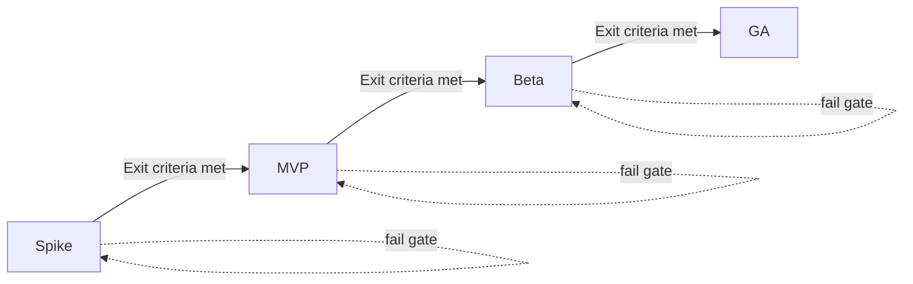

## Goals

- 定义 AgentGeyser 从 `Spike → MVP → Beta → GA` 的分阶段落地路线图，并为每一阶段给出可验收的退出标准（exit criteria）。
- 将技术成熟度与商业化节奏对齐：明确 free/paid tiers、价格与配额假设、以及客户获取（acquisition）实验路径。
- 给产品、工程、GTM、SRE 提供统一里程碑语言，降低“功能完成但不可上市”风险。

## Non-Goals

- 不在本文承诺精确 GA 上线日期；本文提供阶段门槛与决策条件，而非硬编码时间表。
- 不替代 [F12 性能成本](./12-performance-cost.md) 的详细成本公式与 [F14 部署观测](./14-deployment-observability.md) 的运维细节。
- 不新增 API 或模块命名；沿用既有 canonical 命名与 `ag_*` 方法集合。

## Context

本文件 fulfills `F.F16.1`、`F.F16.2`、`F.F16.3`，并承接以下输入：

- [F1 Vision](./01-vision.md)：目标用户与成功指标，为阶段验收定义 North Star。
- [F2 Competitive Landscape](./02-competitive-landscape.md)：决定差异化优先级（“自动持续学习 + AI 代理可调用”）。
- [F3 Architecture](./03-architecture.md) / [F4 Modules](./04-modules.md)：约束阶段实现边界与模块责任。
- [F10 API](./10-api.md)：定义对外最小可售接口（`ag_listSkills`, `ag_invokeSkill`, `ag_planNL`, `ag_getIdl`）。
- [F12 Performance/Cost](./12-performance-cost.md)：提供 SLO 与 unit economics 门槛。
- [F13 Security](./13-security.md)：约束上线前安全闸门（non-custodial invariant、审计钩子）。
- [F15 Skeleton](./15-skeleton.md)：作为 Spike 阶段工程起点。

## Design

### 1) Phase Gate 总览

阶段原则：

1. **Gate-based，不是 date-based**：每阶段必须满足技术+运营+商业三类退出条件。
2. **Progressive hardening**：从“可证明可行”到“可规模化可售卖”。
3. **可回退（reversible）**：任一阶段发现红线问题，允许回退到上阶段修复，不跳级推进。

### 2) Spike 阶段（技术可行性）

目标：证明核心闭环“链上新 Program 发现 → `IdlRegistry` 更新 → `SkillSynthesizer` 产出 → SDK/MCP 可调用”可以跑通。

#### Scope

- 基于 F15 skeleton 搭建最小端到端路径。
- 只支持有限样本 Program（建议 3–5 个高频生态程序）与最小技能集（transfer/swap/stake/mint）。
- `NlPlanner` 仅实现受限意图模板，不开放任意自由文本。

#### Exit Criteria（必须全部满足）

1. **E2E 可演示**：在演示环境中完成至少 1 条从 Geyser 事件到 `ag_listSkills` 可见的自动更新链路。
2. **API 健全性**：四个 `ag_*` 方法均有可执行样例（request/response）并通过 schema 校验。
3. **正确性基线**：`ag_invokeSkill` dry-run 成功率 ≥ 90%（样本集内）。
4. **安全红线**：明确并验证 non-custodial invariant（服务端不托管私钥）。
5. **工程可持续**：主干 CI（lint/typecheck/docs checks）稳定通过。

### 3) MVP 阶段（最小可售版本）

目标：面向 design partners 提供“可持续使用”的托管服务，具备基础可靠性、配额与计费钩子。

#### Scope

- 扩展 Program 覆盖（建议 20–50 个）并建立版本化回滚流程。
- `AuthQuota`、`AuditLog`、基础运维面（metrics/logs/traces）接入。
- 引入 free/paid 两层商业包装（可先 invoice-based，不强依赖自助支付）。

#### Exit Criteria（必须全部满足）

1. **可用性**：核心入口月度可用性达到 99.5%（MVP gate，低于 GA 标准）。
2. **性能门槛**：`ag_listSkills` / `ag_getIdl` p95 分别 ≤ 200ms / 250ms；`ag_planNL` p95 ≤ 2.5s（命中缓存场景）。
3. **成本门槛**：blended LLM cost ≤ $0.003/request（连续 14 天）。
4. **配额与限流**：free tier 限额、429 行为、审计字段完备并可回放。
5. **客户验证**：≥3 家 design partners 每周活跃，且至少 2 家给出“替代现有集成方式”的正向反馈。

### 4) Beta 阶段（产品化与可扩张）

目标：从“可售”转向“可复制增长”，完善自助接入、更强可靠性与安全控制。

#### Scope

- 引入 self-serve onboarding（API key、usage dashboard、文档门户）。
- 扩展 `NlPlanner` 安全策略与风险提示，提升复杂请求成功率。
- 增加多区域/容灾预案与供应商切换演练（主备 Yellowstone + RPC）。

#### Exit Criteria（必须全部满足）

1. **可靠性提升**：月可用性 ≥ 99.9%；关键 API 错误预算在阈值内。
2. **性能稳定**：达到 F12 目标带宽的 70% 以上且无明显长尾劣化（连续 30 天）。
3. **安全完备**：通过外部安全评审（含 prompt injection、恶意 IDL、TX spoofing 场景）。
4. **商业信号**：付费客户 ≥ 10 家，月留存（logo retention）≥ 80%。
5. **运营成熟度**：支持 24x5 值班与标准化 incident runbook。

### 5) GA 阶段（规模化商用）

目标：达到公开可用与稳定增长条件，进入“标准产品运营”状态。

#### Scope

- 完整发布 SLA、支持策略、变更策略（版本兼容与弃用窗口）。
- 完成关键合规/审计流程与财务可观测（收入、成本、毛利实时看板）。
- 推进生态集成（SDK 示例、MCP 生态模板、合作伙伴渠道）。

#### Exit Criteria（必须全部满足）

1. **SLA 达标**：对外承诺 SLA（建议 99.9%+）并连续 2 个计费周期达标。
2. **经济模型健康**：paid tier 毛利率达到目标区间（例如 ≥ 60%，按合同口径）。
3. **增长可持续**：自然增长 + 渠道增长形成双引擎，CAC 回收周期进入目标区间。
4. **支持与治理**：P1 事件响应、RCA、变更审计流程稳定运行。
5. **产品稳定性**：核心 API 无 breaking changes；变更均通过 versioning 与公告策略。

### 6) Free vs Paid Tier 设计（F.F16.3）

#### 6.1 Tier Packaging（初版）

| Tier | Target Users | Included Capabilities | Quota & Limits | Support |
|---|---|---|---|---|
| Free / Builder | 独立开发者、早期 agent 项目 | `ag_listSkills`, `ag_getIdl`, 限量 `ag_invokeSkill`, 受限 `ag_planNL` | 月调用上限 + 严格 RPS + 无高级 planner 路由 | 社区支持 |
| Pro / Team (Paid) | 小团队、交易机器人、成长中 dApp | 全量 `ag_*` + 更高配额 + 高级 `NlPlanner` 路由 + 审计导出 | 更高月度额度，突发弹性，优先队列 | 邮件/工单 SLA |
| Enterprise (Paid) | 机构、交易基础设施、钱包平台 | 专属限额策略、私有化网络选项、合规模块、定制保留策略 | 合同化配额与速率、可选专属部署 | 专属 TAM + SLA |

#### 6.2 Packaging 原则

1. **按价值分层而非按“开关数量”分层**：高级规划质量、可靠性和治理能力是付费核心。
2. **限制 free tier 爆成本路径**：对 `ag_planNL` 高 token 路径启用保守配额与降级模型。
3. **保持升级路径清晰**：free → pro 的门槛基于“调用量 + 可靠性诉求 + 协作需求”。

### 7) Customer Acquisition Hypothesis（F.F16.3）

#### 7.1 ICP 与切入顺序

1. **ICP-A（最快验证）**：正在构建 Solana agent 的开发者团队（需要快速覆盖多 Program）。
2. **ICP-B（中期增长）**：DeFi automation/bot 团队（重视低延迟与可预测成本）。
3. **ICP-C（后期放大）**：钱包/基础设施平台（重视可靠性、审计、合规与 SLA）。

#### 7.2 Acquisition Channels

| Channel | Hypothesis | Primary KPI | Decision Gate |
|---|---|---|---|
| DevRel 内容 + 开源示例 | 高质量教程可降低首次集成成本，拉升激活率 | Time-to-first-success, activation rate | 若 6 周内激活率 < 20%，重写 onboarding |
| Design partner 直销 | 少量深度客户可快速打磨功能与定价 | Weekly active teams, pilot conversion | 若转付费率 < 30%，调整包装/价格 |
| MCP 生态分发（Claude/Cursor 社区） | 通过 Agent 工具市场获取高意向流量 | MCP installs, retained invocations | 若留存差，优先优化工具可解释性 |
| 生态合作（RPC/钱包/孵化器） | 借渠道触达机构客户 | Qualified pipeline, enterprise trials | 若线索质量低，收缩合作范围 |

#### 7.3 Pricing & Monetization 假设（初版）

- **Free**：零价格，强调试用与反馈收集；防止滥用（严格限流/配额）。
- **Pro**：订阅制（月付/年付），含基础超额计费（calls 或 token bucket）。
- **Enterprise**：合同制（commit + overage），可附加私有网络、审计保留、专属支持。

关键验证指标：

1. Free → Paid 转化率（目标区间由阶段定义，例如 Beta ≥ 5–10%）。
2. NRR（net revenue retention）与毛利率协同改善。
3. `ag_planNL` 使用深度与留存的相关性（判断其是否为核心价值锚点）。

### 8) 里程碑决策机制与回退策略

- **Stage Review Cadence**：每两周一次 gate review，参与方含 Eng / PM / GTM / SRE / Security。
- **Go / Hold / Rollback** 三态决策：
  - **Go**：满足全部硬门槛，进入下一阶段。
  - **Hold**：软门槛不达标，允许补强后复审。
  - **Rollback**：触发红线（安全、数据一致性、经济不可持续）必须回退。
- **Rollback 触发示例**：
  - 连续两周单位成本超守卫线且优化无效；
  - 发生 non-custodial invariant 违规事件；
  - 核心 API 出现不可控 breaking behavior。

## Key Decisions & Alternatives

| Decision | Chosen | Alternatives | Trade-offs |
|---|---|---|---|
| 路线图框架 | Gate-based（Spike/MVP/Beta/GA） | 固定日期驱动 | Gate-based 更抗不确定性，但对治理纪律要求更高 |
| 商业化起点 | MVP 即引入 free/paid 双层 | Beta 后再定价 | 更早验证 unit economics，但会增加早期产品复杂度 |
| Acquisition 策略 | design partners + DevRel 并行 | 单一渠道先打透 | 并行更快找到 PMF 信号，但执行面更分散 |
| Paid 价值锚点 | 可靠性 + 高级 planner + 审计能力 | 纯调用量打包 | 价值锚点更可防价格战，但沟通成本更高 |
| GA 门槛 | 技术+商业双门槛 | 仅技术门槛 | 降低“技术上线但商业失败”风险，但推进速度可能更慢 |

## Risks & Open Questions

- **Risk**：阶段 gate 定义不清导致“看似通过、实则不可运营”。  
  **Mitigation**：每个 gate 绑定可度量 KPI 与数据来源。
- **Risk**：free tier 被脚本滥用，拉高 LLM 与 RPC 成本。  
  **Mitigation**：更严格 `AuthQuota`、行为异常检测、分层限流。
- **Risk**：过早追求 Enterprise 需求导致路线偏航。  
  **Mitigation**：在 Beta 前锁定核心 ICP-A/ICP-B，企业特性仅保留必要集合。
- **Open Question**：Pro tier 的最佳计费维度是“API 调用数”还是“LLM token + 调用混合”？
- **Open Question**：GA 前是否需要第三方合规认证（SOC 2 / ISO 27001）作为销售门槛？

## References

- [F1 Vision](./01-vision.md)
- [F2 Competitive Landscape](./02-competitive-landscape.md)
- [F3 Architecture](./03-architecture.md)
- [F4 Modules](./04-modules.md)
- [F10 API](./10-api.md)
- [F12 Performance & Cost](./12-performance-cost.md)
- [F13 Security](./13-security.md)
- [F14 Deployment & Observability](./14-deployment-observability.md)
- [F15 Skeleton](./15-skeleton.md)

<!--
assertion-evidence:
  F.F16.1: frontmatter at top of docs/design/16-roadmap.md includes doc/title/owner/status/depends-on/updated.
  F.F16.2: sections "2) Spike 阶段", "3) MVP 阶段", "4) Beta 阶段", "5) GA 阶段" each define explicit exit criteria.
  F.F16.3: section "6) Free vs Paid Tier 设计" documents free vs paid tiers; section "7) Customer Acquisition Hypothesis" defines acquisition hypotheses, channels, KPIs, and pricing assumptions.
-->
