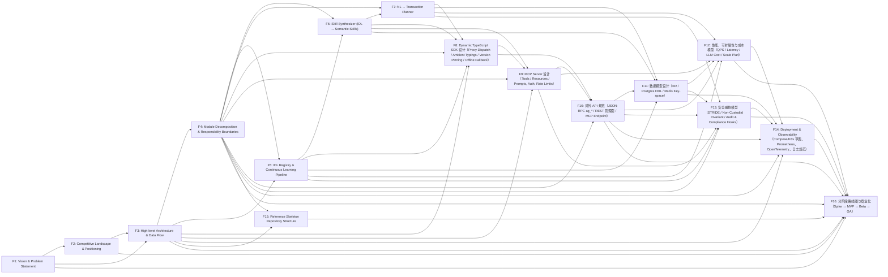

# Design Documents Index

This index provides a fast reading path across the 16 AgentGeyser design docs. Start with vision and architecture (F1–F4), then move through core subsystems (F5–F9), API/data contracts (F10–F11), non-functional and operations design (F12–F14), and finish with skeleton and roadmap (F15–F16). The dependency graph captures declared `depends-on` relations from each doc frontmatter so you can follow prerequisite context before deep-diving a document.

## Document Index

| Doc | Title | Status | Path |
| --- | --- | --- | --- |
| F1 | Vision & Problem Statement | draft | [docs/design/01-vision.md](./01-vision.md) |
| F2 | Competitive Landscape & Positioning | draft | [docs/design/02-competitive-landscape.md](./02-competitive-landscape.md) |
| F3 | High-level Architecture & Data Flow | draft | [docs/design/03-architecture.md](./03-architecture.md) |
| F4 | Module Decomposition & Responsibility Boundaries | draft | [docs/design/04-modules.md](./04-modules.md) |
| F5 | IDL Registry & Continuous Learning Pipeline | draft | [docs/design/05-idl-registry.md](./05-idl-registry.md) |
| F6 | Skill Synthesizer (IDL → Semantic Skills) | draft | [docs/design/06-skill-synthesizer.md](./06-skill-synthesizer.md) |
| F7 | NL → Transaction Planner | draft | [docs/design/07-nl-planner.md](./07-nl-planner.md) |
| F8 | Dynamic TypeScript SDK 设计（Proxy Dispatch / Ambient Typings / Version Pinning / Offline Fallback） | draft | [docs/design/08-sdk.md](./08-sdk.md) |
| F9 | MCP Server 设计（Tools / Resources / Prompts, Auth, Rate Limits） | draft | [docs/design/09-mcp-server.md](./09-mcp-server.md) |
| F10 | 对外 API 规范（JSON-RPC ag_* / REST 管理面 / MCP Endpoint） | draft | [docs/design/10-api.md](./10-api.md) |
| F11 | 数据模型设计（ER / Postgres DDL / Redis Key-space） | draft | [docs/design/11-data-model.md](./11-data-model.md) |
| F12 | 性能、可扩展性与成本模型（QPS / Latency / LLM Cost / Scale Plan） | draft | [docs/design/12-performance-cost.md](./12-performance-cost.md) |
| F13 | 安全威胁模型（STRIDE / Non-Custodial Invariant / Audit & Compliance Hooks） | draft | [docs/design/13-security.md](./13-security.md) |
| F14 | Deployment & Observability（Compose/K8s 草案、Prometheus、OpenTelemetry、日志规范） | draft | [docs/design/14-deployment-observability.md](./14-deployment-observability.md) |
| F15 | Reference Skeleton Repository Structure | draft | [docs/design/15-skeleton.md](./15-skeleton.md) |
| F16 | 分阶段路线图与商业化（Spike → MVP → Beta → GA） | draft | [docs/design/16-roadmap.md](./16-roadmap.md) |

## Dependency Graph

<!-- assertion-evidence: X.1: this file exists and links all 16 docs -->
